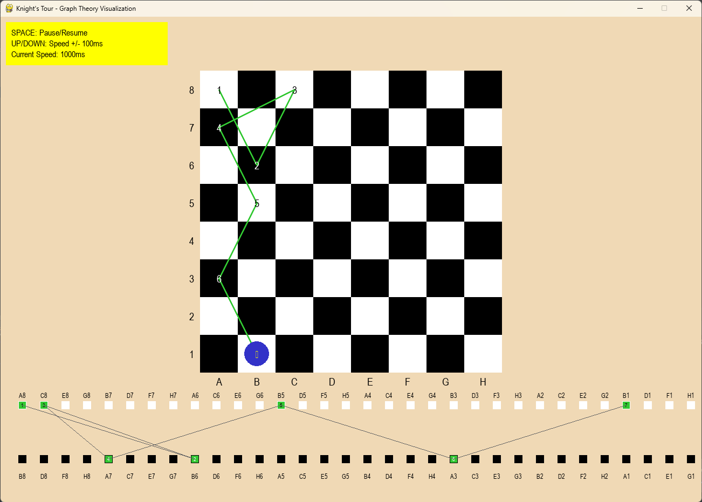

# Knight's Tour Visualization

A Python program that visualizes the Knight's Tour problem using PyGame, with interactive controls for pausing and speed adjustment.

 *Example screenshot*

## Features

- Visualizes the Knight's Tour problem on a chessboard
- Shows the corresponding graph theory representation (bipartite graph)
- Interactive controls:
  - **Space**: Pause/Resume the animation
  - **Up Arrow**: Increase speed (reduce delay by 100ms)
  - **Down Arrow**: Decrease speed (increase delay by 100ms)
- Displays move numbers on each square
- Shows chess notation (A1-H8) for positions

## Graph Theory Concepts Illustrated

1. Chessboard as a graph where each square is a vertex
2. Edges connect squares that are a knight's move apart
3. The Knight's Tour as a Hamiltonian path
4. Bipartite graph structure (alternating between white and black squares)
5. Warnsdorff's algorithm implementation (heuristic for finding the tour)

## Requirements

- Python 3.x
- PyGame

## Installation

1. Clone the repository:
   ```bash
   git clone https://github.com/yourusername/knights-tour.git
   cd knights-tour
   ```
2. Install the requirements:  
   ```bash
   pip install -r requirements.txt 
   ```
3. Run the program:
    ```bash
   python knights_tour.py
   ```
## License

This project is open source and available under the [MIT License](LICENSE).

## Support

For issues and questions, please create an issue in the GitHub repository.